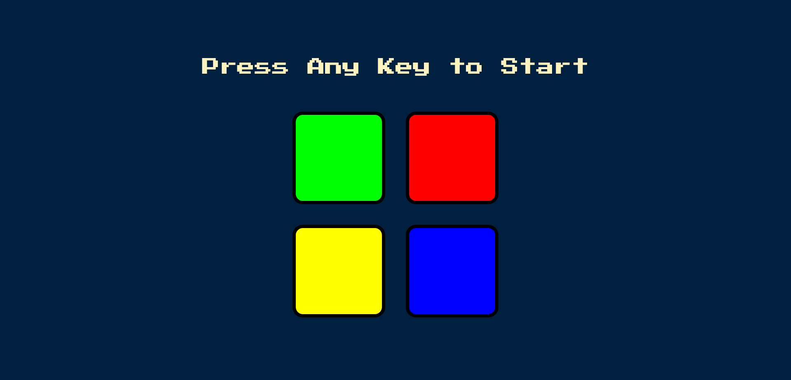
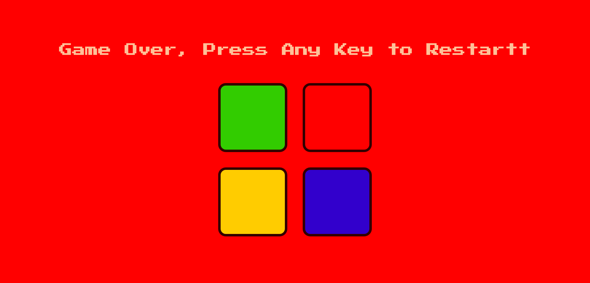

# Simon Says Game Project

Inspired from an electronic game of short-term memory skill invented by **Ralph H. Baer** and **Howard J. Morrison**, working for toy design firm Marvin Glass and Associates, with software programming by Lenny Cope. The device creates a series of tones and lights and requires a user to repeat the sequence. [Source](<https://en.wikipedia.org/wiki/Simon_(game)>)

## Table of contents

- [Overview](#overview)
  - [The challenge](#the-challenge)
  - [Screenshot](#screenshot)
  - [Links](#links)
- [My process](#my-process)
  - [Built with](#built-with)
- [Author](#author)
- [Acknowledgments](#acknowledgments)

## Overview

### The challenge

Users should be able to:

- See colors flash
- Hear sounds
- Experience the game logic

### Screenshot

### Links

- Live Site URL: [https://quiel-simon-says-game.netlify.app/](https://quiel-simon-says-game.netlify.app/)

## My process

### Built with

- HTML5
- CSS3
- JavaScript

## Author

- GitHub - [quielLovesLasagna](https://github.com/quielLovesLasagna)

## Acknowledgments

I would like to thank **Dr. Angela Yu** for the guidance throughout the project.
